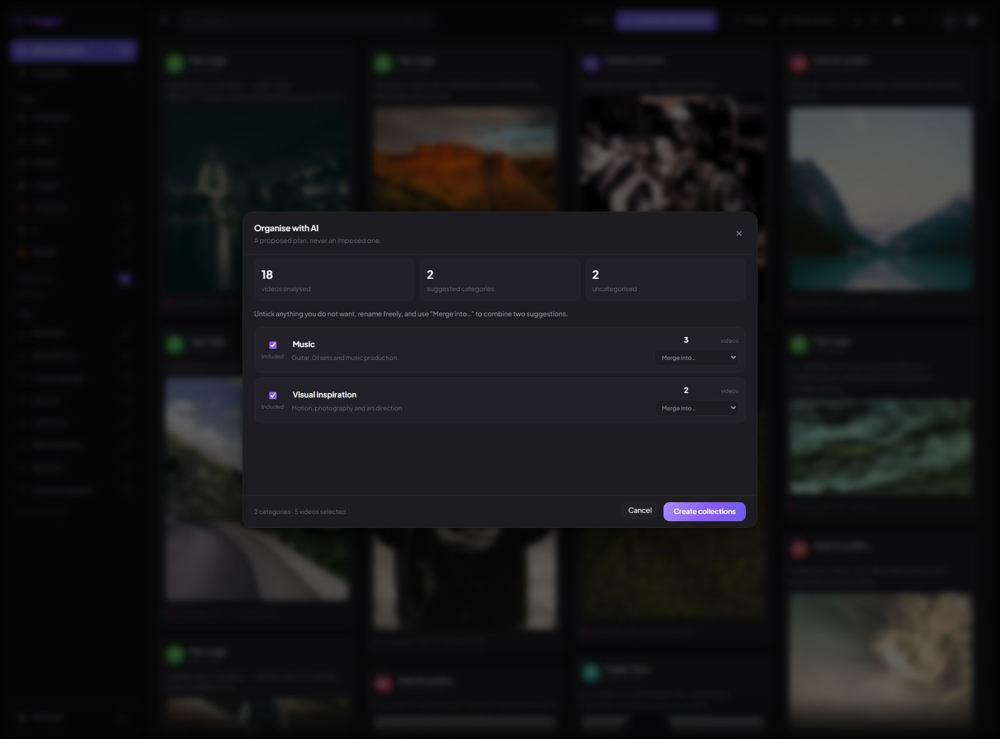
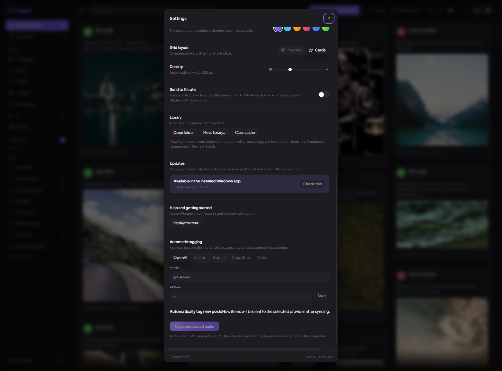

<p align="center">
  
</p>

<p align="center">
  <a href="https://github.com/BeeeFX/Magpie/releases/latest"></a>
  <a href="https://github.com/BeeeFX/Magpie/releases/latest"></a>
</p>

<p align="center">
  <strong>Instagram, X and Reddit bookmarks — together in one calm, visual library.</strong><br>
  Browse them like a moodboard, find them again with tags, and keep the whole collection on your own computer.
</p>

<p align="center"><sub>Windows 10/11 · Free and open source · English & French · Light & dark themes</sub></p>


## Stop losing the things you saved

Magpie turns hundreds of scattered saved posts into a fast Pinterest-style wall. Connect your accounts once, then browse everything together or focus on a single platform. Your scroll position, filters and open posts stay where you left them.

| See everything | Make it yours | Find it later |
| --- | --- | --- |
| Responsive masonry grid, images, carousels and an integrated video player. | Favourites, coloured labels, tags, collections and bulk actions. | Search, platform and media filters, automatic tags and multiple sorting options. |

### Designed for real collections

- Connect **Instagram, X and Reddit** and sync them at the same time.
- Watch each account’s progress and resume long imports safely.
- Choose the grid density, light/dark theme and colour accent.
- Control video quality, shared volume and the maximum media-cache size.
- Select many posts at once to tag, favourite, copy or add to a collection.
- Optionally organise new posts with OpenAI, Claude, Gemini, DeepSeek or another compatible model.
- Move the whole library to another drive whenever it gets large.
- Receive **automatic Windows updates** in the background from version 0.2.0 onward.

### AI suggests. You decide.

Magpie can analyse your video descriptions, thumbnails and existing tags, then propose a collection plan. Nothing is created immediately: rename categories, exclude any you do not want, or merge related ideas — for example guitar, DJ sets and production into one **Music** collection — before applying the plan.



<p align="center">
  
  
</p>

## Install in a minute

1. Open the **[latest Magpie release](https://github.com/BeeeFX/Magpie/releases/latest)**.
2. Download `Magpie-Setup-x.y.z.exe` and follow the installer.
3. Open Magpie and connect your first account in the welcome tour.

> Magpie is not code-signed yet, so Windows SmartScreen may show a warning. Check that the publisher page is this repository before continuing. A SHA-256 checksum is included with every release.

Users upgrading from 0.1.1 need to install 0.2.0 manually once. After that, Magpie checks stable GitHub releases automatically, downloads updates in the background and asks before restarting to install them.

## Private by default

Your posts, tags, collections and cached media stay on your computer. Platform sessions live in separate Chromium partitions, and Magpie never sees the password entered on the platform’s real login page.

AI tagging is off by default. If enabled, post text and a thumbnail may be sent to the provider you choose. The API key is encrypted using the operating system’s secure storage.

## Good to know

Magpie is an independent project and is not affiliated with Meta, X Corp. or Reddit. It reads the same private web endpoints used by their websites, which may change over time. Sync reasonably and follow the terms that apply to your accounts.

macOS and Linux packages are planned; their builds are configured but not yet signed or tested for this first release.

<details>
<summary><strong>For developers and contributors</strong></summary>

### Local development

Requirements: Node.js 22 and npm.

```bash
npm install
npm run dev
```

Checks and Windows packaging:

```bash
npm run typecheck
npm run check:layout
npm run build
npm run dist:win
```

### Architecture

- Electron for the desktop shell, isolated platform sessions, background work and updates;
- React + Zustand for the interface;
- SQLite/FTS5 for local storage and search;
- Sharp for thumbnails and FFmpeg for adaptive video streams;
- electron-builder + electron-updater for NSIS releases and differential updates.

A tag matching the `package.json` version triggers the Windows release workflow. It publishes the installer, blockmap, `latest.yml` update manifest and SHA-256 checksum to GitHub Releases.

</details>

## License

MIT — see [LICENSE](LICENSE).
