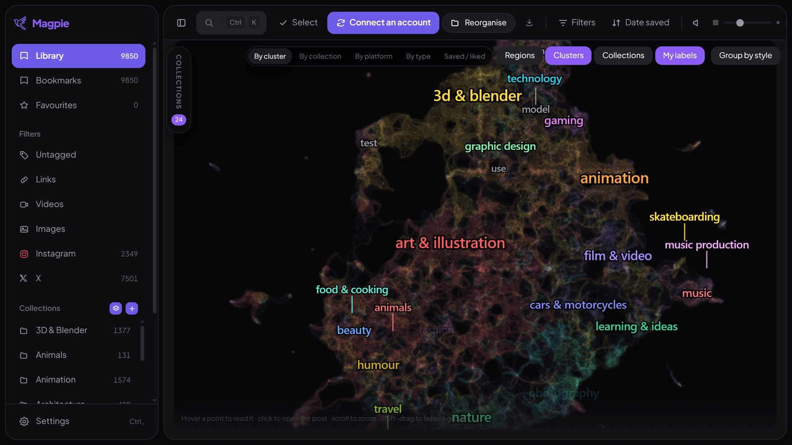
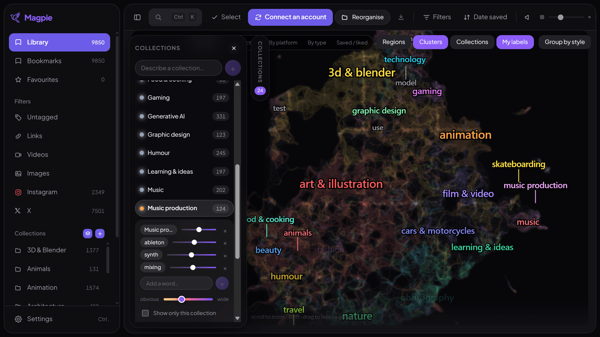

<p align="center">
  
</p>

<p align="center">
  <a href="https://github.com/BeeeFX/Magpie/releases/latest"></a>
  <a href="https://github.com/BeeeFX/Magpie/releases/latest"></a>
</p>

<p align="center">
  <a href="https://github.com/BeeeFX/Magpie/releases/latest"></a>
  <a href="https://github.com/BeeeFX/Magpie/releases"></a>
  <a href="LICENSE"></a>
</p>

<p align="center">
  <strong>Your Instagram and X bookmarks and likes, together in one calm visual library.</strong><br>
  Browse thousands of saved posts like a moodboard, organise them on your own machine —<br>
  and see the whole thing at once, as a map.
</p>

<p align="center"><sub>Windows 10/11 · Free and open source · English & French · Light & dark themes</sub></p>


## The things you saved, finally useful

Magpie turns scattered posts into a fast Pinterest-style wall. Connect Instagram or X, choose **Bookmarks**, **Likes**, or **Both**, then browse everything together or filter it instantly. A post that appears in both feeds stays a single item.

| Browse naturally | Organise your way | Stay fast at scale |
| --- | --- | --- |
| Masonry wall, regular cards, or the map. Hover previews with sound, carousels, and an integrated video player. | Collections, tags, favourites, colour labels, accent-insensitive search and bulk actions. | Virtualised scrolling and a bounded smart cache, built for libraries of tens of thousands of posts. |

## A wall you want to keep scrolling

The point of a moodboard is that you see things you were not looking for. Magpie's main view is a dense wall of everything you ever saved, and it is built to be scrolled for a long time.

- **Two grids and a density slider.** The masonry wall lets every post keep its own height; card view gives them all the same one, with the author and an excerpt always visible. Columns run from 140 to 400 px, so the same library can be a contact sheet or a gallery.
- **Hover brings it to life.** Videos play in place, looped, muted until you want the sound; carousels fade through their views with position dots and return to the first image when you leave. Only the tile under the cursor is ever mounted, so nothing stutters.
- **Filter and search without waiting.** Bookmarks or likes, Instagram or X, images, videos, links, untagged — plus accent-insensitive search across captions, authors and tags. Add tags, favourites and colour labels as you go, in bulk when it is quicker.
- **It picks up where you left it.** Your last search, filters, sorting and scroll position come back with the app.
- **Ten thousand posts scroll like ten.** Each post's dimensions and dominant colour are read at import, so the wall computes its layout without loading a single image.

## Organise locally — no account, no API key, no cloud

Magpie can sort your library into useful collections by itself, and it does the whole thing on your computer. Two paths, and you pick one:


**Quick** reads captions, hashtags, tags, creators and thumbnails, then proposes a list of collections for you to correct. A few minutes.

**Thorough** goes further, and unlocks the map. Two local vision models look at every thumbnail — and at three frames from each cached video, because the cover of a clip rarely says what the clip is about. Whisper transcribes what is spoken, in the language it is actually spoken in, guessed from the caption and from the library around it: a French reel heard as English does not come out approximate, it comes out invented. One to two hours, resumable, and it tells you what each step costs before you start.

Looking is what makes the difference, because a third of a typical library has no usable caption. Measured on a 9,600-post library, filing rose from 1,299 to 2,445 of those posts once the images had a say.

Analysing does not commit you to anything: what it proposes are ordinary collections, and you can rename, recolour, merge or delete any of them afterwards — or undo the whole run in one click.

## Push it further: the whole library as one picture

Once the thorough pass has run, Magpie can draw everything you saved as a map — **one dot per post, placed so that distance is similarity**. It is the view that answers *what goes with what*, which is usually the real question in front of nine thousand posts. Dense areas name themselves, zooming in reveals finer regions inside the big ones, and clicking a point opens the post beside the map without losing your place. Colour the dots by cluster, collection, platform or media type, lasso a group with Shift-drag to name it yourself, and one button lays the map out again by visual style instead of subject. Positions are frozen once computed, so later syncs place new posts against the map you already know.

Collections work the same way: **a name, a few words, and a reach**. Write “music production”, add “ableton”, “synth”, “mixing” with their own weights, and Magpie scores every post against them — a phrase alone can file thousands. The reach is a number of posts rather than a confidence score, and that is deliberate: ranking is trustworthy, absolute scores are not, so you decide where to stop while the map paints the gradient underneath.

<p align="center">
  
  
</p>

## Hand your library to your own assistant

Magpie can write out a folder that Claude, ChatGPT or any other assistant can read on its own: captions, transcripts, authors, tags and collections, one line per post to skim and one file per post to open when needed, plus a prompt you can edit. No key, no account, nothing leaves your machine unless you hand over the folder yourself.

## Made for large libraries

- Sync Instagram and X in parallel, with visible progress and resumable long imports.
- Stream full images and videos only when opened; choose video quality in the player.
- Use the default **Smart cache** to prepare only the 480p thumbnails you browse, and set a disk limit: recently viewed thumbnails stay available while older ones are replaced automatically.
- Choose offline video storage only if you explicitly want a larger local archive.
- Watch background work from one panel — tile images, video downloads, transcription — and pause it, or cap its bandwidth, whenever you need the network back.
- Move the complete library and cache to another drive at any time.
- Receive automatic Windows updates in the background.

<p align="center">
  
  
</p>

## Install in a minute

1. Open the **[latest Magpie release](https://github.com/BeeeFX/Magpie/releases/latest)**.
2. Download `Magpie-Setup-x.y.z.exe` and follow the installer.
3. Open Magpie, choose where its library should live, then connect Instagram or X.

> Magpie is not code-signed yet, so Windows SmartScreen may show a warning. Check that the publisher page is this repository before continuing.

Magpie checks stable GitHub releases automatically, downloads updates in the background, and asks before restarting to install one.

## Private by default

Your posts, tags, collections, database and cached thumbnails stay on your computer. In Smart cache mode, full media is streamed from its platform only when you open it and is not stored permanently. Platform sessions live in separate Chromium partitions, and Magpie never sees the password entered on the platform's real login page.

Reading your images, transcribing your videos, grouping them and drawing the map all run locally. No captions, thumbnails or account data are sent to an external AI service.

## Good to know

Magpie is an independent project and is not affiliated with Meta or X Corp. It uses the private web endpoints used by the platforms themselves, which may change over time. Sync reasonably and follow the terms that apply to your accounts.

Reddit support is currently hidden while its integration is being redesigned. macOS and Linux packages are planned but are not yet tested or signed.

<details>
<summary><strong>For developers and contributors</strong></summary>

### Local development

Requirements: Node.js 22 and npm.

```bash
npm install
npm run dev
```

Type checking, the guard suite and Windows packaging:

```bash
npm run typecheck
npm run check:db
npm run check:media
npm run check:organizer
npm run check:vision
npm run check:transcribe
npm run check:map
npm run check:islands
npm run check:library-guard
npm run build
npm run dist:win
```

`npm run preview:web` opens the interface in an ordinary browser against a snapshot written by the last `npm run dev`, which is enough to iterate on layout and CSS without Electron around.

### Architecture

- Electron for the desktop shell, isolated platform sessions, background work and updates;
- React + Zustand for the interface, with a hand-rolled virtualised layout;
- SQLite/FTS5 for local storage and search;
- `@huggingface/transformers` for the local text, vision and Whisper models, and `umap-js` in a worker thread for the map projection;
- Sharp for bounded 480p thumbnails and FFmpeg for adaptive video streams and frame extraction;
- electron-builder + electron-updater for NSIS releases and differential updates.

A tag matching the `package.json` version triggers the Windows release workflow. It publishes the installer, blockmap and `latest.yml` update manifest to GitHub Releases.

</details>

## License

MIT — see [LICENSE](LICENSE).
