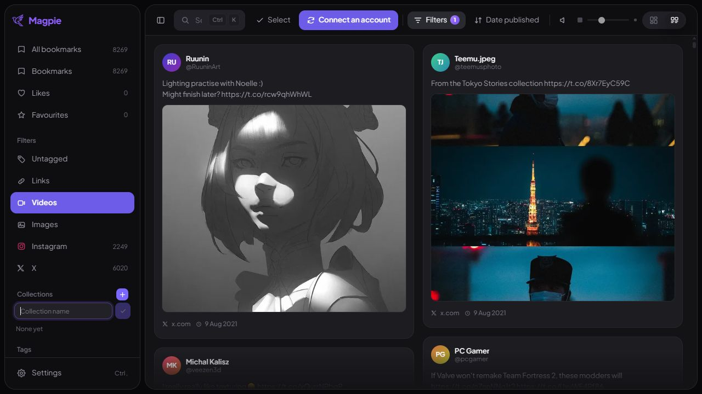
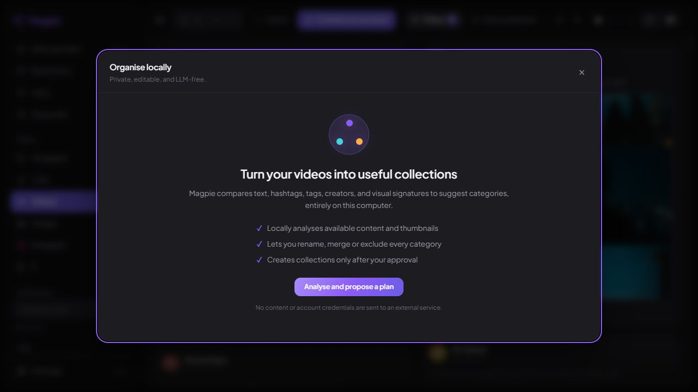
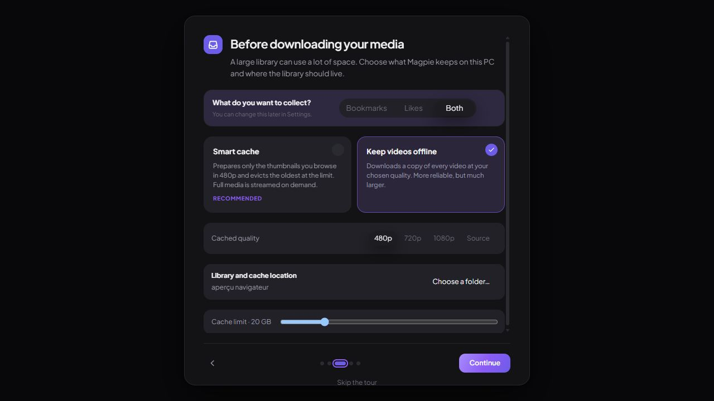
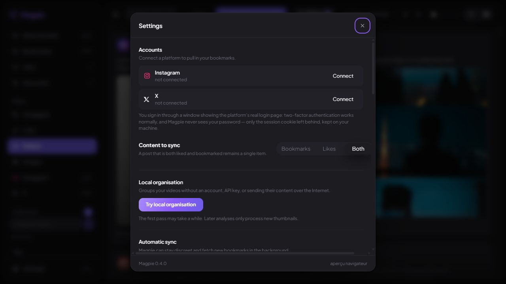

<p align="center">
  
</p>

<p align="center">
  <a href="https://github.com/BeeeFX/Magpie/releases/latest"></a>
  <a href="https://github.com/BeeeFX/Magpie/releases/latest"></a>
</p>

<p align="center">
  <strong>Your Instagram and X bookmarks and likes, together in one calm visual library.</strong><br>
  Browse thousands of saved posts like a moodboard, organise them locally, and find them again.
</p>

<p align="center"><sub>Windows 10/11 · Free and open source · English & French · Light & dark themes</sub></p>



## The things you saved, finally useful

Magpie turns scattered posts into a fast Pinterest-style wall. Connect Instagram or X, choose **Bookmarks**, **Likes**, or **Both**, then browse everything together or filter it instantly. A post that appears in both feeds stays a single item.

| Browse naturally | Organise your way | Stay fast at scale |
| --- | --- | --- |
| Masonry or card grid, hover previews, carousels and an integrated video player. | Collections, tags, favourites, colour labels, search and bulk actions. | Virtualised scrolling and a bounded smart cache designed for libraries with tens of thousands of posts. |

### Made for large libraries

- Sync Instagram and X in parallel, with visible progress and resumable long imports.
- Keep your last search, filters, sorting and scroll position between sessions.
- Stream full images and videos only when opened; choose video quality in the player.
- Use the default **Smart cache** to prepare only the 480p thumbnails you browse.
- Set a disk limit: recently viewed thumbnails stay available while older ones are replaced automatically.
- Choose offline video storage only if you explicitly want a larger local archive.
- Move the complete library and cache to another drive at any time.
- Receive automatic Windows updates in the background.

## Organise locally — no LLM or API key

Magpie can compare captions, hashtags, tags, creators and local visual signatures to suggest useful collections. The analysis runs on your computer and works incrementally, including on very large libraries.

Nothing is filed without your approval: rename a category, exclude it, or merge related suggestions before creating the collections.



<p align="center">
  
  
</p>

## Install in a minute

1. Open the **[latest Magpie release](https://github.com/BeeeFX/Magpie/releases/latest)**.
2. Download `Magpie-Setup-x.y.z.exe` and follow the installer.
3. Open Magpie, choose where its library should live, then connect Instagram or X.

> Magpie is not code-signed yet, so Windows SmartScreen may show a warning. Check that the publisher page is this repository before continuing.

Magpie checks stable GitHub releases automatically, downloads updates in the background, and asks before restarting to install one.

## Private by default

Your posts, tags, collections, database and cached thumbnails stay on your computer. In Smart cache mode, full media is streamed from its platform only when you open it and is not stored permanently. Platform sessions live in separate Chromium partitions, and Magpie never sees the password entered on the platform's real login page.

Local organisation does not send captions, thumbnails or account data to an external AI service.

## Good to know

Magpie is an independent project and is not affiliated with Meta or X Corp. It uses the private web endpoints used by the platforms themselves, which may change over time. Sync reasonably and follow the terms that apply to your accounts.

Reddit support is currently hidden while its integration is being redesigned. macOS and Linux packages are planned but are not yet tested or signed.

<details>
<summary><strong>For developers and contributors</strong></summary>

### Local development

Requirements: Node.js 22 and npm.

```bash
npm install
npm run dev
```

Checks and Windows packaging:

```bash
npm run typecheck
npm run check:layout
npm run check:db
npm run check:media
npm run check:organizer
npm run build
npm run dist:win
```

### Architecture

- Electron for the desktop shell, isolated platform sessions, background work and updates;
- React + Zustand for the interface;
- SQLite/FTS5 for local storage and search;
- Sharp for bounded 480p thumbnails and FFmpeg for adaptive video streams;
- electron-builder + electron-updater for NSIS releases and differential updates.

A tag matching the `package.json` version triggers the Windows release workflow. It publishes the installer, blockmap and `latest.yml` update manifest to GitHub Releases.

</details>

## License

MIT — see [LICENSE](LICENSE).
